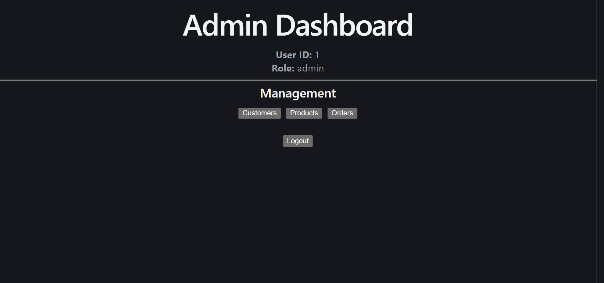
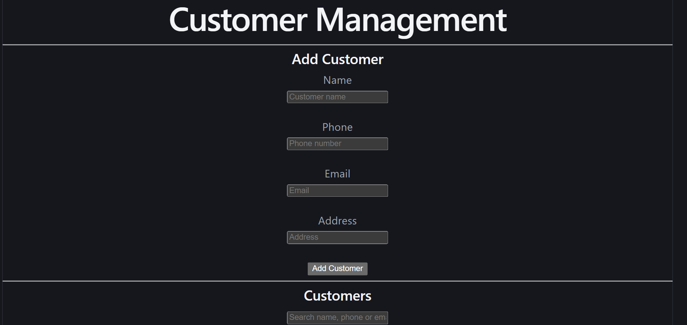
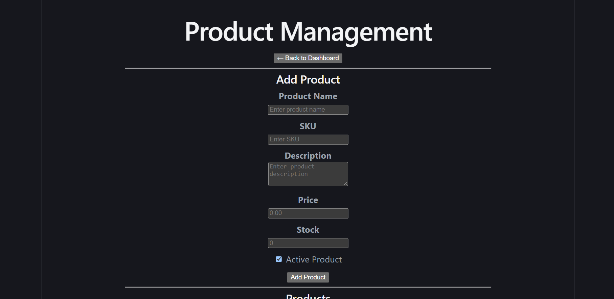
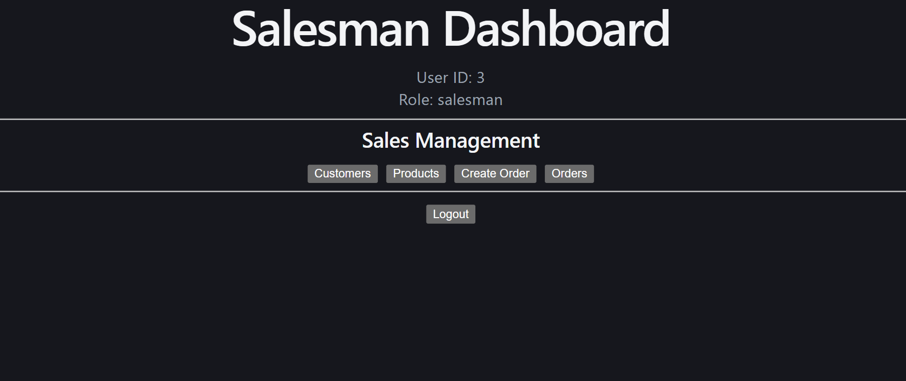
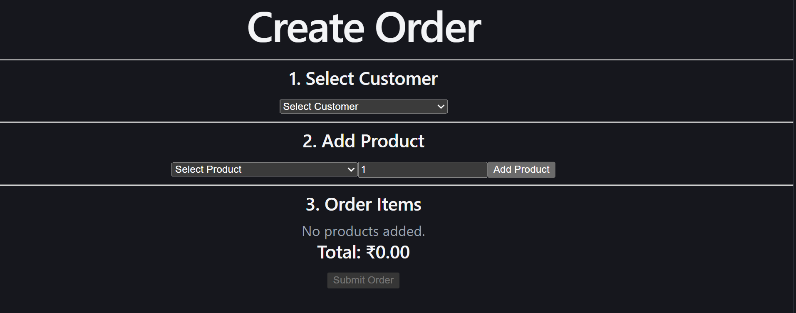
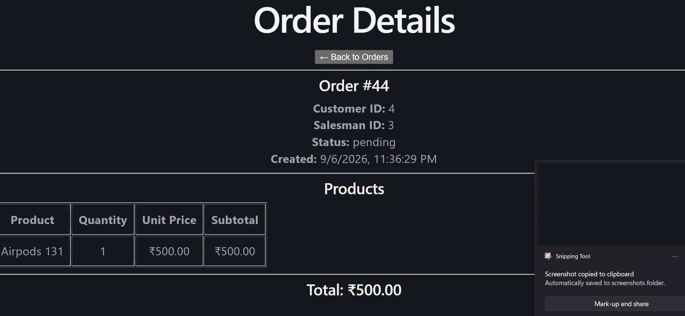

# Sales Management System

A full-stack sales management application built using **FastAPI, PostgreSQL, and React**.

I built this project to handle common sales operations such as managing customers and products, creating orders, tracking inventory, and managing users based on their roles.

There are two frontend applications:

* **Admin Dashboard** – for managing customers, products, and orders.
* **Salesman App** – for salesmen to view products and customers, create orders, and check their order history.

Both applications communicate with the same FastAPI backend.

---

## Project Overview

The main idea of the project is to keep the admin and salesman functionality separate while using one backend and database.

### Admin can

* Manage customers
* Manage products
* Manage stock
* View all orders
* Update order status
* Delete orders
* View order details

### Salesman can

* Login
* View customers
* View products
* Create orders
* Add multiple products to an order
* Change quantities
* Remove products from the cart
* View their orders
* View order details
* Search and filter orders

---

## Features

### Authentication

* JWT authentication
* Password hashing
* Login
* Protected API routes
* Protected frontend routes
* Role-based authorization

### Customer Management

Admin users can create, update, view, search, and delete customers.

Salesmen can view and search customers.

### Product Management

Products contain information such as:

* Product name
* SKU
* Description
* Price
* Stock
* Active/inactive status

Admins can create, update, and delete products.

Salesmen can view available products and their details.

### Orders

The order module supports:

* Creating orders
* Selecting a customer
* Adding multiple products
* Changing product quantities
* Removing products
* Calculating subtotals
* Calculating the final order total
* Checking stock before creating an order
* Reducing stock after a successful order
* Viewing order history
* Viewing order details
* Searching and filtering orders

---

## Technology Used

### Backend

* Python
* FastAPI
* SQLAlchemy
* PostgreSQL
* Pydantic
* JWT
* Passlib
* bcrypt
* Uvicorn

### Frontend

* React
* JavaScript
* Vite
* Axios
* React Router

### Testing

* Pytest
* FastAPI TestClient

### Tools

* Git
* GitHub
* VS Code
* Linux / WSL
* Swagger / OpenAPI

---

## Project Structure

```text
sales-management-system/
│
├── backend/
│   ├── app/
│   │   ├── auth/
│   │   ├── database/
│   │   ├── models/
│   │   ├── routers/
│   │   ├── schemas/
│   │   ├── services/
│   │   └── main.py
│   │
│   ├── tests/
│   ├── create_admin.py
│   ├── create_salesman.py
│   ├── create_tables.py
│   ├── requirements.txt
│   └── .env.example
│
├── admin_dashboard/
│   ├── src/
│   │   ├── pages/
│   │   ├── services/
│   │   └── App.jsx
│   ├── package.json
│   └── vite.config.js
│
├── salesman_app/
│   ├── src/
│   │   ├── components/
│   │   ├── pages/
│   │   ├── services/
│   │   └── App.jsx
│   ├── package.json
│   └── vite.config.js
│
├── .gitignore
└── README.md
```

---

## How It Works

The basic flow is:

```text
Admin / Salesman
       ↓
   React App
       ↓
   FastAPI API
       ↓
   SQLAlchemy
       ↓
  PostgreSQL
```

The admin dashboard and salesman app don't connect directly to PostgreSQL. All database operations go through the FastAPI backend.

---

## Database

The main tables used in the project are:

```text
users
customers
products
orders
order_items
```

### Users

The `users` table stores login and role information.

```text
id
name
email
password_hash
role
```

The two roles are:

```text
admin
salesman
```

### Customers

Stores customer details:

```text
id
name
phone
email
address
```

### Products

Stores product information:

```text
id
name
sku
description
price
stock
active
```

### Orders

Stores the main information about an order:

```text
id
customer_id
salesman_id
status
total_amount
created_at
```

### Order Items

An order can contain more than one product, so the individual products are stored in `order_items`.

```text
id
order_id
product_id
quantity
unit_price
subtotal
```

For example, if a customer orders a mouse, keyboard, and headphones, there will be one row in `orders` and three rows in `order_items`.

---

## Authentication

The backend uses JWT for authentication.

The login flow is:

```text
Login
  ↓
POST /auth/login
  ↓
Check email and password
  ↓
Generate JWT token
  ↓
Frontend stores token
  ↓
Token sent with API requests
  ↓
Backend validates token
```

Passwords are hashed before being stored in the database.

---

## Role-Based Access

The backend checks the user's role before allowing protected operations.

| Feature         | Admin | Salesman |
| --------------- | :---: | :------: |
| View customers  |  Yes  |    Yes   |
| Create customer |  Yes  |    No    |
| Edit customer   |  Yes  |    No    |
| Delete customer |  Yes  |    No    |
| View products   |  Yes  |    Yes   |
| Create product  |  Yes  |    No    |
| Edit product    |  Yes  |    No    |
| Delete product  |  Yes  |    No    |
| Create order    |  Yes  |    Yes   |
| View all orders |  Yes  |    No    |
| View own orders |  Yes  |    Yes   |
| Update order    |  Yes  |    No    |
| Delete order    |  Yes  |    No    |

The permission checks are done on the backend, not just in the React applications.

---

## Order Calculation

The backend gets the product price from the database when creating an order.

For each item:

```text
subtotal = price × quantity
```

For the complete order:

```text
total = sum of all item subtotals
```

Example:

```text
Wireless Mouse
Price: ₹799
Quantity: 2

Subtotal = ₹799 × 2
         = ₹1598
```

The frontend does not decide the final product price or order total.

---

## Inventory

Before creating an order, the backend checks whether enough stock is available.

```text
Requested quantity
        ↓
Check product stock
        ↓
Enough stock?
   ↓          ↓
  Yes         No
   ↓          ↓
Create      Reject
order       order
   ↓
Reduce stock
```

After a successful order:

```text
new stock = current stock - ordered quantity
```

This prevents an order from being created when the requested quantity is greater than the available stock.

---

# API Endpoints

## Authentication

```http
POST /auth/login
GET  /me
```

## Customers

```http
GET    /customers
GET    /customers/{customer_id}
POST   /customers
PUT    /customers/{customer_id}
DELETE /customers/{customer_id}
```

## Products

```http
GET    /products
GET    /products/{product_id}
POST   /products
PUT    /products/{product_id}
DELETE /products/{product_id}
```

## Orders

```http
GET    /orders
GET    /orders/{order_id}
POST   /orders
PUT    /orders/{order_id}
DELETE /orders/{order_id}
```

## Order Items

```http
GET  /orders/{order_id}/items
POST /orders/{order_id}/items
```

## Health Check

```http
GET /health
```

---

# Running the Project Locally

## Requirements

You will need:

* Python 3
* Node.js
* npm
* PostgreSQL
* Git

---

## Backend

Clone the repository first:

```bash
git clone https://github.com/Ramprasad13x/sales-management-system.git

cd sales-management-system
```

Go to the backend:

```bash
cd backend
```

Create a virtual environment:

```bash
python3 -m venv venv
source venv/bin/activate
```

Install the Python packages:

```bash
pip install -r requirements.txt
```

Create a `.env` file inside `backend`:

```env
DATABASE_URL=your_postgresql_connection_string
JWT_SECRET_KEY=your_secret_key
```

You can use `.env.example` as a starting point.

Create the database tables:

```bash
python create_tables.py
```

Create an admin user:

```bash
python create_admin.py
```

Create a salesman user:

```bash
python create_salesman.py
```

Start the backend:

```bash
uvicorn app.main:app --reload
```

The API will be available at:

```text
http://127.0.0.1:8000
```

Swagger documentation:

```text
http://127.0.0.1:8000/docs
```

---

# Admin Dashboard

Open another terminal:

```bash
cd admin_dashboard
npm install
npm run dev
```

The admin dashboard runs on:

```text
http://localhost:5174
```

---

# Salesman App

Open another terminal:

```bash
cd salesman_app
npm install
npm run dev
```

The salesman application runs on:

```text
http://localhost:5173
```

---

# Testing

Backend tests are written using Pytest and FastAPI TestClient.

Run the tests with:

```bash
cd backend
source venv/bin/activate
pytest -v
```

The tests cover things such as:

* Health check
* Login
* Invalid login
* Customer APIs
* Product APIs
* Order APIs
* Authorization
* Invalid order requests
* Order business logic

---

# Security

Some of the security measures used in the project are:

* JWT authentication
* Password hashing
* Role-based authorization
* Protected API endpoints
* Protected frontend routes
* Backend-side price calculation
* Backend-side stock validation
* Pydantic validation
* Environment variables for secrets

The `.env` file is excluded from Git so database credentials and JWT secrets are not pushed to GitHub.

---

# Screenshots

Screenshots of the application can be added here.

### Admin Dashboard



### Customer Management



### Product Management



### Salesman Dashboard



### Create Order



### Order Details



---

---

# Live Deployment

The application is deployed using Vercel and Render.

### GitHub Repository

https://github.com/Ramprasad13x/sales-management-system

### FastAPI Backend

https://sales-management-api-7yey.onrender.com

### API Documentation

https://sales-management-api-7yey.onrender.com/docs

### Admin Dashboard

https://sales-management-system-omega-five.vercel.app

### Salesman Application

https://sales-management-system-abah.vercel.app

### Database

PostgreSQL is deployed on Render and is connected to the FastAPI backend.

The production database contains the following tables:

- users
- customers
- products
- orders
- order_items

The frontend applications communicate with the FastAPI backend, and the backend communicates with the PostgreSQL database.

---

# Test Credentials

The following credentials are provided for testing the deployed applications.

### Admin
Email: admin@example.com
Password: Admin@123
Role: admin

### Salesman
Email: salesman@example.com
password: Salesman@123
Role: salesman

# Future Improvements

Some things I would like to add later:

* Sales analytics
* Sales charts and reports
* Salesman performance reports
* Product sales reports
* Pagination
* Better filtering
* More complete order status workflow
* Email notifications
* PDF invoices
* Docker setup
* CI/CD
* Cloud deployment
* Frontend tests
* Refresh token support

---

# Author

**Ram Prasad**

ECE Graduate | Full Stack Developer

Technologies used in this project:

```text
Python
FastAPI
PostgreSQL
SQLAlchemy
React
JavaScript
JWT
Pytest
Git
GitHub
```

---

# License

This project was created as a technical assessment and portfolio project.
